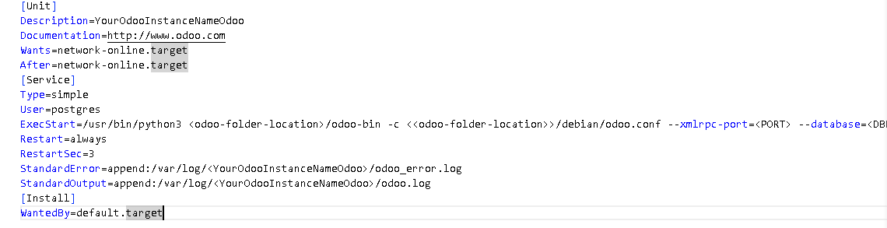
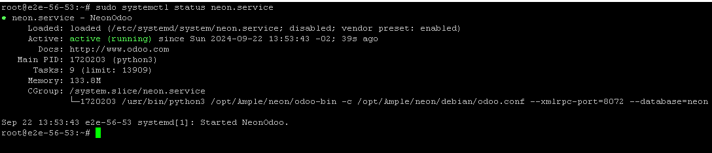
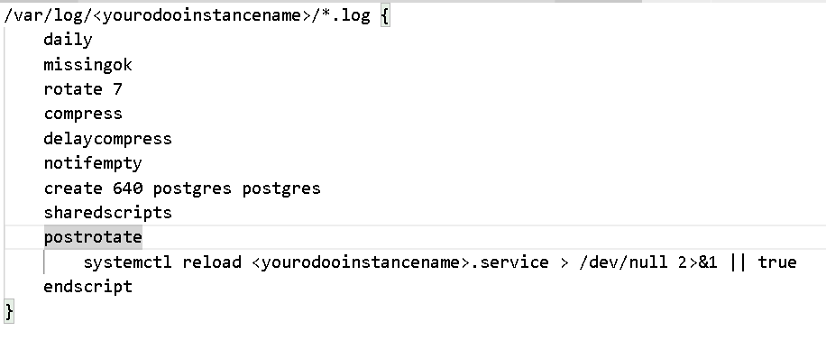

Odoo Production Deployment Document

1.  Copy the odoo community code to a specific location on server.
2.  Install all the python dependency using pip command (pip -r requiremt.txt)
3.  Create a separate service for the odoo instance by using below steps
4.  Navigate to location **/etc/systemd/system**
5.  Create a service file using command **nano** **\<yourodooinstancename\>.service**
6.  Paste below content on file **\<yourodooinstancename\>.service**
7.  Change file permission using command **sudo chmod 755 \<yourodooinstancename\>.service**
8.  Change file owner using command **sudo chown root: \<yourodooinstancename\>.service**
9.  Go the **\<odoo-folder-location\>/Debian/odoo.conf** and search for logfile key and paste the value **/var/log/\< yourodooinstancename\>/odoo.log**
10. Create log folder using command **mkdir -p /var/log/\< yourodooinstancename\>**
11. Navigate to location **/var/log/yourodooinstancename** using command   
    **cd /var/log/yourodooinstancename** and create two file using command   
    **touch odoo.log odoo_error.log**
12. Change the file permission using command **sudo chmod 640 odoo.log odoo_error.log**
13. Chnage the file owner using command **sudo chown postgres: odoo.log odoo_error.log**
14. Execute the command for service reload **sudo systemctl daemon-reload**
15. Now execute the command **sudo systemctl start \<yourodooinstancename\>.service**
16. Execute the command **sudo systemctl status \<yourodooinstancename\>.service** to check if service is running or not. If service is running then you will below response.
17. If service is not **active(running)** go to location **/var/log/\<yourodooinstancename\>/odoo_error.log** to check the issue.
18. Execute the command **sudo systemctl stop \<yourodooinstancename\>.service** to stop the service/instance
19. Execute the command command **sudo systemctl enable \<yourodooinstancename\>.service** to auto start the service wherever system rebooted.
20. Now implement the log rotation for the logs.

Odoo Log Rotation Step

1.  Navigate to location **/etc/logrotate.d**
2.  Create a file using command **nano \<yourodooinstancename\>**
3.  Paste the below code to the file **\<yourodooinstancename\>**
4.  Execute the command **sudo logrotate -d yourodooinstancename** to implement log rotation.
5.  Execute the command **sudo logrotate -f yourodooinstancename** to test the log rotation.**  
    **
